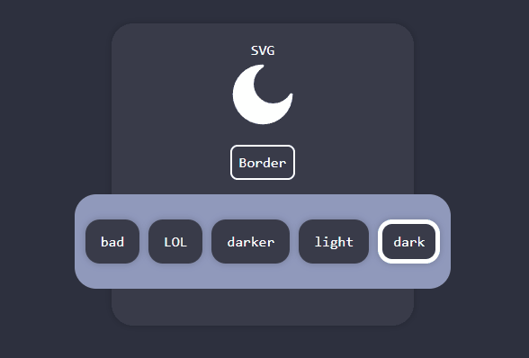
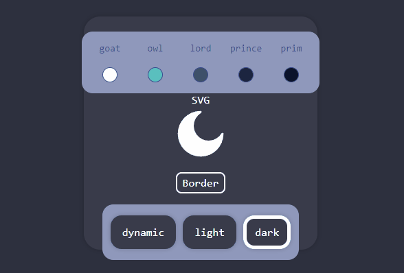

# Moon style
Moon style is a versatile CSS utility package that helps you quickly and easily generate styles for your web projects. It provides a set of predefined styles and themes that you can customize to match your project's design.

## Installation
You can install Moon style using Yarn:

```bash
yarn add moon-style --dev
```
### Or using NPM
```bash
npm install moon-style --dev
```
### It is recommended to install moon-style as a dev dependency because it is only used in the development phase to generate the css file

## Getting Started
### Configuration
Moon style relies on a configuration file named `moon.config.json` to generate styles. If you don't already have this file in your project, Moon style will create a default configuration for you at `./moon.config.json`.

The default configuration includes predefined styles for properties like `padding`, `margin`, `font-size`, and more. You can customize this configuration to suit your project's needs.

### Customization (Optional)
If you want to customize the default styles or define new ones, open the `moon.config.json` file in your project and modify it according to your requirements. You can specify your own values for various properties, change colors, and define new themes.

### CSS Generation
To generate the CSS based on your configuration, run the following command:

```bash
yarn moon
```
### Or using NPM
```bash
npm run moon

```

This will generate a `moon.css` file in your project's output directory, applying the styles defined in your `moon.config.json` file ,and also watch the `moon.config.json` file for changes and automatically regenerate the `moon.css` file when you save the changes.


### Importing CSS
To apply the generated styles to your project, import the `moon.css` file in your main TypeScript (`main.ts`) or JavaScript (`index.js`) file:

```javascript
import './path/to/moon.css'; // Replace with the actual path to moon.css
```
### If you are using the default configuration you will find the generated css in the `./src` directory of your project
```javascript
import './src/moon.css';
```

Make sure to replace `./path/to/moon.css` with the correct path to your `moon.css` file.

### Themes
Moon style comes with predefined themes that you can use or modify in your `moon.config.json` file. Themes include color palettes and other design elements to quickly change the look and feel of your project.

### Output Path
By default, the generated `moon.css` file is placed in the `./src` directory of your project. You can customize the output path in your `moon.config.json` file by modifying the `outputPath` property.

### Example Configuration
Here's an example of a `moon.config.json` file with predefined styles and themes:

```json
{
  "$schema": "./node_modules/moon-style/dist/moon.config.schema.json",
  "useStaticNumbers": false,// Determines whether to use static numbers or css variables
  "outputPath": "./src",// The output path of the generated css file
  "content": ["./src/**/*.{html,js,jsx,tsx}"],//  the files that will be scanned for classes to be purged
  "styles": [
    {
      "props": {
        //  the css property name : the generated class name 
         "padding": "p",
         "margin": "m" 
      },
      "variableName": "spacing",// the variable name that will be used in the generated css
      "values": { 
        // the values of the css variable 
        "sm": "4px",
        "md": "8px",
        "custom": "23.5px"
        // you can add more values here
      } 
    },
    // Add more styles here
  ],
    "colors": {
    "options": {
      "*": {
        "opacities": [0.05, 0.1, 0.2, 0.5, 0.7, 0.9],
        "props": ["bg", "fill", "border", "text"]
        // this will generate the following classes for [ each ] color
        // .bg-red-50, .bg-red-100 , .bg-red-200 , .bg-red-500 , .bg-red-700 , .bg-red-900
        // .fill-red-50, .fill-red-100 , .fill-red-200 , .fill-red-500 , .fill-red-700 , .fill-red-900
        // .border-red-50, .border-red-100 , .border-red-200 , .border-red-500 , .border-red-700 , .border-red-900
        // .text-red-50, .text-red-100 , .text-red-200 , .text-red-500 , .text-red-700 , .text-red-900
        // .bg-lord-50, .bg-lord-100 , .bg-lord-200 , .bg-lord-500 , .bg-lord-700 , .bg-lord-900
        // .text-lord-50, .text-lord-100 , .text-lord-200 , .text-lord-500 , .text-lord-700 , .text-lord-900
        /* ...and so on */
      },
      "prim": {
        "opacities": [0.05, 0.1, 0.2, 0.5, 0.7, 0.9],
        "props": ["bg", "fill", "border"]
        // this will generate the following classes for the [ prim ] color
        // .bg-prim-50, .bg-prim-100 , .bg-prim-200 , .bg-prim-500 , .bg-prim-700 , .bg-prim-900
        // .fill-prim-50, .fill-prim-100 , .fill-prim-200 , .fill-prim-500 , .fill-prim-700 , .fill-prim-900
        // .border-prim-50, .border-prim-100 , .border-prim-200 , .border-prim-500 , .border-prim-700 , .border-prim-900
      }
    },
    "staticColors": {
      "red": "#dd3643",
      "cyan": "#63cfc9",
      "nice": "#83d6e1",
      "cute": "#a3e4cb",
      "green": "#7bc74d"
    },
    "themes": {
      "light": {
        "prim": "#FFFFFF",
        "prince": "#f0f0f0",
        "lord": "#909090",
        "owl": "#1f1d2b",
        "goat": "#c4c4c7"
      },
      "dark": {
        "prim": "#2d303e",
        "prince": "#393c4a",
        "lord": "#9099bc",
        "owl": "#ffffff",
        "goat": "#3c4f8d"
      },
      "darker": {
        "prim": "#0b132b",
        "prince": "#1c2541",
        "lord": "#3a506b",
        "owl": "#5bc0be",
        "goat": "#ffffff"
      },
      "bad": {
        "prim": "#949ba0",
        "prince": "#9dacb2",
        "lord": "#a0b9bf",
        "owl": "#c4edff",
        "goat": "#bcd4de"
      },
      "LOL": {
        "prim": "#211a1e",
        "prince": "#c3423f",
        "lord": "#9bc53d",
        "owl": "#fde74c",
        "goat": "#393c4a"
      }
    }
  },
    // Define more themes here
}
```

### This config will generate the following css
###  The generated root variables
```css
:root {
  --red: #dd3643;
  --cyan: #63cfc9;
  --nice: #83d6e1;
  --cute: #a3e4cb;
}
```
### The generated themes
```css
.light {
  --prim: #FFFFFF;
  --prince: #f6f6f6;
  --owl: #1f1d2b;
  --goat: #c4c4c7;
  --prim-50: rgba(255, 255, 255, 0.05);/* ...and so on */
}
.dark {
  --prim: #2d303e;
  --prince: #393c4a;
  --owl: #ffffff;
  --goat: #9e9fa6;
  --prim-50: rgba(45, 48, 62, 0.05);/* ...and so on */
}
.LOL {
    --prim: #211a1e;
  --prince: #c3423f;
  --owl: #fde74c;
  --goat: #393c4a;
  --prim-50: rgba(33, 26, 30, 0.05);/* ...and so on */
}

.bg-prim { background-color: var(--prim) } .bg-prim-50 {var(--prim-50) } .bg-prim-100 {var(--prim-100) } .bg-prim-200 {var(--prim-200) } /* ...and so on */
.fill-prim { fill: var(--prim) } .fill-prim-50 {var(--prim-50) } .fill-prim-100 {var(--prim-100) } .fill-prim-200 {var(--prim-200) } /* ...and so on */
.border-prim { border-color: var(--prim) } .border-prim-50 {var(--prim-50) } .border-prim-100 {var(--prim-100) } .border-prim-200 {var(--prim-200) } /* ...and so on */
.bg-prince { background-color: var(--prince) } .bg-prince-50 {var(--prince-50) } .bg-prince-100 {var(--prince-100) } .bg-prince-200 {var(--prince-200) } /* ...and so on */
.bg-red { background-color: var(--red) } .bg-red-50 {var(--red-50) } .bg-red-100 {var(--red-100) } .bg-red-200 {var(--red-200) } /* ...and so on */
.text-red { color: var(--red) } .text-red-50 {var(--red-50) } .text-red-100 {var(--red-100) } .text-red-200 {var(--red-200) } /* ...and so on */
/* ...and so on */
```
### The generated classes 
```css
:root {
  --sm: 4px;
  --md: 8px;
  --custom: 23.5px;
}

.p-sm { padding:var(--spacing-sm)  } 
.m-sm { margin:var(--spacing-sm)  } 
.pr-md { padding-right:var(--spacing-md)  } 
.mx-sm { margin-inline:var(--spacing-sm)  } 
.mr-custom { margin-right:var(--spacing-custom)  }
.py-custom { padding-block:var(--spacing-custom)  }
/* ...and so on */
.pr-sm { padding-right:var(--spacing-sm)  }
.mr-custom { margin-right:var(--spacing-custom)  }
.pl-md { padding-left:var(--spacing-md)  }
.ml-custom { margin-left:var(--spacing-custom)  }
/* ...and so on */
```
### Usage

### You can use the generated classes in your html like this
```html
<div className="p-md m-custom bg-prim text-red"></div>
```


### Or you can use the variables in your css like this
```css
.my-class{
  background-color: var(--prim);
  color: var(--red);
  padding: var(--spacing-md);
  margin: var(--spacing-custom);
}
```
# Example
### You can use the generated classes in your react app like this
  
```js 
import React from "react";
import { Moon } from "moon-style";
import { Theme } from "../Moon.Types";

Moon.setTheme("dark");

const themes: Theme[] = ["dark", "light", "darker", "LOL", "bad"];

const App = () => {
    const [theme, setTheme] = React.useState(Moon.currentTheme);
    return (
        <div className="inset-0 fixed bg-prim col">
            <div className="bg-prince round-xl p-md shadow-lg size-5x m-auto">
                <div className="m-auto col items-center p-xl font-mono">
                    <span className="text-owl">SVG</span>
                    <svg className="size-md" viewBox="0 0 24 24" fill="none">
                        <path
                            className="fill-owl"
                            d="M12 22C17.5228 22 22 17.5228 22 12C22 11.5373 21.3065 11.4608 21.0672 11.8568C19.9289 13.7406 17.8615 15 15.5 15C11.9101 15 9 12.0899 9 8.5C9 6.13845 10.2594 4.07105 12.1432 2.93276C12.5392 2.69347 12.4627 2 12 2C6.47715 2 2 6.47715 2 12C2 17.5228 6.47715 22 12 22Z"
                        />
                    </svg>
                    <p className="border-thick border-solid border-owl round-md p-md text-owl">Border</p>
                    <div className="row gap-lg bg-lord round-xl p-xl">
                        {themes.map((item, index) => {
                            return (
                                <p
                                    key={index}
                                    onClick={() => {
                                        Moon.setTheme(item);
                                        setTheme(item);
                                    }}
                                    style={{
                                        border: `5px solid ${item === theme ? "var(--owl)" : "var(--prince)"}`,
                                    }}
                                    className="pointer bg-prince text-owl py-lg px-xl round-lg text-x shadow-lg">
                                    {item}
                                </p>
                            );
                        })}
                    </div>
                </div>
            </div>
        </div>
    );
};

export default App;

```

### The result should be like this
<!--  -->


<!-- PurgeCss section -->
# PurgeCss
## What is PurgeCss?
PurgeCSS is a tool to remove unused CSS. It can be used as part of your development workflow. PurgeCSS comes with a JavaScript API, a CLI, and plugins for popular build tools learn more about PurgeCss [here](https://purgecss.com/).


## How to use PurgeCss with Moon style?
<!-- 
 -->
PurgeCSS is already included as a dependency in this project, so there's no need to install it separately 
so you just need to add the `content` property to your `moon.config.json` file and specify the files that you want to scan for classes to be purged.
### Example
```json
{
  "content": ["./src/**/*.{html,js,jsx,tsx}"],
}
```
### This will scan all the files in the `./src` directory with the extensions `html,js,jsx,tsx` for classes to be purged

## How to run PurgeCss?
### You can run PurgeCss by running this command
```bash
yarn moon-purge
```
### Or using NPM
```bash
npm run moon-purge
```

### This command will clean the `moon.css` file from the unused classes 

## How to restore the purged classes?

### You can restore the purged classes by running this command
```bash
yarn moon
```
### Or using NPM
```bash
npm run moon
```
### This command will regenerate the `moon.css`  file with the classes that you have defined in your `moon.config.json` file


# API

### `Moon`

The `Moon` object is a utility provided by Moon style to manage themes and colors. You can use the following methods and properties:

- **`Moon.currentTheme`:** Returns the current active theme.

  ```javascript
  import { Moon } from "moon-style";
  const theme = Moon.currentTheme; // Returns the current theme (e.g., "light", "dark", "great")
  ```
- **`Moon.setTheme(theme: string)`:** Sets the specified theme as the current theme.

  ```javascript
  import { Moon } from "moon-style";
  Moon.setTheme("dark"); // Sets the "dark" theme
  ```
- **`Moon.setColors(colors: { [key: string]: string })`:** Sets the specified colors as CSS variables.

  ```javascript
  import { Moon } from "moon-style";
  Moon.setColors({ red: "#dd3643", cyan: "#63cfc9" ,prim : "#FFFFFF"}); // Sets the "red" and "cyan" colors
  ```
- **`Moon.setColor(key: string, value: string)`:** Sets the specified color as a CSS variable.

  ```javascript
  import { Moon } from "moon-style";
  Moon.setColor("red", "#dd3643"); // Sets the "red" color
  ```
- **`Moon.removeColors()`:** Removes all custom colors.

  ```javascript
  import { Moon } from "moon-style";
  Moon.removeColors(); // Removes all custom colors
  Moon.removeColors(["cyan","prim"]); // Removes the custom colors "cyan" and "prim" 
  ```
- **`Moon.removeColor(key: string)`:** Removes the specified custom color.

  ```javascript
  import { Moon } from "moon-style";
  Moon.removeColor("red"); // Removes the custom "red" color
  ```
## Examples of useing the API
### In this Example we will use setColor and setColors to change the colors of the theme
```js
import React from "react";
import { Moon } from "moon-style";
import { Theme } from "../Moon.Types";

let dynimcColors: any = {
    prim: "#0b132b",
    prince: "#1c2541",
    lord: "#3a506b",
    owl: "#5bc0be",
    goat: "#ffffff",
};

Moon.setColors(dynimcColors);
const themes: Theme[] = ["dark", "light"];

const App = () => {
    const [theme, setTheme] = React.useState(Moon.currentTheme || "dynamic");
    return (
        <div className="inset-0 fixed bg-prim col">
            <div className="bg-prince round-xl p-lg shadow-lg size-5x m-auto ">
                <div className="m-auto col items-center p-xl font-mono">
                    <div className="row gap-2x bg-lord p-2x round-lg">
                        {Object.entries(dynimcColors).map(([key, value]) => {
                            return <ColorPicker key={key} name={key} value={value} />;
                        })}
                    </div>
                    <span className="text-owl">SVG</span>
                    <svg className="size-md" viewBox="0 0 24 24" fill="none">
                        <path
                            className="fill-owl"
                            d="M12 22C17.5228 22 22 17.5228 22 12C22 11.5373 21.3065 11.4608 21.0672 11.8568C19.9289 13.7406 17.8615 15 15.5 15C11.9101 15 9 12.0899 9 8.5C9 6.13845 10.2594 4.07105 12.1432 2.93276C12.5392 2.69347 12.4627 2 12 2C6.47715 2 2 6.47715 2 12C2 17.5228 6.47715 22 12 22Z"
                        />
                    </svg>
                    <p className="border-thick border-solid border-owl round-md px-md py-sm text-owl">Border</p>
                    <div className="row gap-lg bg-lord round-lg px-xl">
                        {themes.map((item, index) => {
                            return (
                                <p
                                    key={index}
                                    onClick={() => {
                                        Moon.setTheme(item);
                                        setTheme(item);
                                    }}
                                    style={{
                                        border: `5px solid ${item === theme ? "var(--owl)" : "var(--prince)"}`,
                                    }}
                                    className="pointer bg-prince text-owl py-lg px-xl round-lg text-x shadow-lg">
                                    {item}
                                </p>
                            );
                        })}
                        <p
                            onClick={() => {
                                Moon.setColors(dynimcColors);
                                setTheme("dynamic");
                            }}
                            style={{
                                border: `5px solid ${theme === "dynamic" ? "var(--owl)" : "var(--prince)"}`,
                            }}
                            className="pointer bg-prince text-owl py-lg px-xl round-lg text-x shadow-lg">
                            dynamic
                        </p>
                    </div>
                </div>
            </div>
        </div>
    );
};

export default App;

const ColorPicker = ({ name = "", value }) => {
    const ref = React.useRef(null);
    return (
        <div className="col-center font-mono text-goat">
            <p className="text-center text-sm m-auto">{name}</p>
            <input
                ref={ref}
                type="color"
                className="opacity-0 h-0"
                defaultValue={value as any}
                onChange={(e) => {
                    dynimcColors[name] = e.target.value;
                    Moon.setColor(name as any, e.target.value);
                }}
            />
            <p
                onClick={() => {
                    (ref as any).current.click();
                }}
                className={`size-xs round-full border-thin border-solid pointer m-auto bg-${name}`}
                style={{ backgroundColor: value }}
            />
        </div>
    );
};

```
<!--  -->


# Static Classes 
## This classes will always be generated in the css file
```css
.fixed {position:fixed;} 
.absolute {position:absolute;} 
.relative {position:relative;} 
.sticky {position:-webkit-sticky;position:sticky;} 
.static {position:static;} 
.initial {position:initial;} 
.inherit {position:inherit;} 
.unset {position:unset;} 
```
- `fixed`: This class sets the CSS property position to fixed, which positions the element relative to the viewport.
- `absolute`: This class sets the CSS property position to absolute, which positions the element relative to its closest positioned ancestor.
- `relative`: This class sets the CSS property position to relative, which positions the element relative to its normal position.
- `sticky`: This class sets the CSS property position to sticky, which positions the element based on the user's scroll position.
- `static`: This class sets the CSS property position to static, which positions the element according to the normal flow of the document.
- `initial`: This class sets the CSS property position to initial, which sets the position to its default value.
- `inherit`: This class sets the CSS property position to inherit, which inherits the position from its parent element.
- `unset`: This class sets the CSS property position to unset, which resets the position to its default value.

```css
 .flex-grow {flex-grow:1;}
```
This class sets the CSS property `flex-grow` to `1`, which allows the element to grow to fill the available space.

```css
.flex, .row, .col, .wrap, .center {display:flex;}
```
These classes set the CSS property `display` to flex, which allows you to use flexbox to control the layout of elements. For example, `flex` makes the element a flex container, while `row` makes the element a flex container with a row layout.

```css
.flex,.row,.col,.wrap,.center,.row-center,.col-center{display:flex;}
```
```css
.row-center, .center {align-items:center;}
.row-start {align-items:flex-start;}
.row-end {align-items:flex-end;}
```
- `row-center`, `center`: These classes vertically align the items in a flex container to the center.
- `row-start`: These classes vertically align the items in a flex container to the start.
- `row-end`: These classes vertically align the items in a flex container to the end.

```css
.col, .col-center, .col-start, .col-end {flex-direction:column;}
```
```css
.col-center,.center{justify-content:center;}
.col-start{justify-content:flex-start;}
.col-end{justify-content:flex-end;}
```
- `col-center`, `center`: These classes horizontally align the items in a flex container to the center.
- `col-start`: These classes horizontally align the items in a flex container to the start.
- `col-end`: These classes horizontally align the items in a flex container to the end.


```css
.wrap {flex-wrap:wrap;}
```
`wrap`: This class sets the CSS property `flex-wrap` to `wrap`, allowing flex containers to wrap their items to the next line if they exceed the container's width.

```css
.select-none {user-select:none;} 
.select-text {user-select:text;} 
.select-all {user-select:all;} 
.select-auto {user-select:auto;}
```
- `select-none`: This class sets the CSS property user-select to none, which prevents text selection on elements with this class.
- `select-auto`: This class sets the CSS property user-select to auto, allowing the default user-select behavior on elements with this class.
- `select-text`: This class sets the CSS property user-select to text, allowing text selection on elements with this class.
- `select-all`: This class sets the CSS property user-select to all, enabling the selection of all content within elements with this class.


```css 
.overflow-auto {overflow:auto;}
.overflow-scroll {overflow:scroll;}
.overflow-hidden {overflow:hidden;}
.overflow-visible {overflow:visible;}
```
- `overflow-auto`: This class sets the CSS property overflow to auto, allowing the element to scroll when its content overflows.
- `overflow-scroll`: This class sets the CSS property overflow to scroll, forcing the element to have a scroll bar when its content overflows.
- `overflow-hidden`: This class sets the CSS property overflow to hidden, hiding any content that overflows the element's boundaries.
- `overflow-visible`: This class sets the CSS property overflow to visible, making all content within the element visible, even if it overflows the container.
```css
.overflow-x-auto {overflow-x:auto;}
.overflow-x-scroll {overflow-x:scroll;}
.overflow-x-hidden {overflow-x:hidden;}
.overflow-x-visible {overflow-x:visible;}
 ```
These classes control horizontal overflow behavior, similar to the previous set of classes, but specifically for the `overflow-x` property.

```css
.overflow-y-auto {overflow-y:auto;}
.overflow-y-scroll {overflow-y:scroll;}
.overflow-y-hidden {overflow-y:hidden;}
.overflow-y-visible {overflow-y:visible;}
```

These classes control vertical overflow behavior, similar to the previous set of classes, but specifically for the `overflow-y` property.

```css
.hide-scroller::-webkit-scrollbar {display:none;}
```
`hide-scroller`: This class uses the `::-webkit-scrollbar` pseudo-element to hide the scroll bar in WebKit-based browsers (like Safari and Chrome) for elements with this class. It effectively removes the scroll bar's appearance.


```css
.h-screen {height:100vh;} 
.w-screen {width:100vw;} 
.w-fill {width:100%;}
.h-fill {height:100%;}
```
These classes set the CSS properties height and `width` to specific values, allowing you to control the element's `height` and `width`. For example, `h-screen` sets the element's height to 100vh, while `w-screen` sets the element's width to 100vw.

```css
.min-w-max {min-width:max-content;}
```
`min-w-max`: This class sets the CSS property min-width to max-content, allowing the element to have a minimum width based on its content.

```css
.items-center {align-items:center;}
.items-start {align-items:flex-start;}
.items-end {align-items:flex-end;}
```
- `items-center`: This class aligns the items in a flex container vertically and horizontally to the center.
- `items-start`: This class aligns the items in a flex container vertically to the start.
- `items-end`: This class aligns the items in a flex container vertically to the end.

```css
.justify-center {justify-content:center;}
.justify-start {justify-content:flex-start;}
.justify-end {justify-content:flex-end;}
.justify-between {justify-content:space-between;}
.justify-around {justify-content:space-around;}
.justify-evenly {justify-content:space-evenly;}
```
- `justify-center`: This class horizontally aligns the items in a flex container to the center.
- `justify-start`: This class horizontally aligns the items in a flex container to the start.
- `justify-end`: This class horizontally aligns the items in a flex container to the end.
- `justify-between`: This class evenly distributes the items along the main axis with space between them.
- `justify-around`: This class evenly distributes the items along the main axis with space around them.
- `justify-evenly`: This class evenly distributes the items along the main axis with equal space between them.

```css
.self-start {align-self:flex-start;}
.self-center {align-self:center;}  
.self-end {align-self:flex-end;}
.self-stretch {align-self:stretch;}
```
- `self-start`: This class aligns an individual flex item to the start within a flex container.
- `self-center`: This class aligns an individual flex item to the center within a flex container.
- `self-end`: This class aligns an individual flex item to the end within a flex container.
- `self-stretch`: This class stretches an individual flex item to fill the container along the cross-axis.
```css
.col-span-full {grid-column:1 / -1;}    
.col-span-1 {grid-column:span 1 / span 1;}
.col-span-2 {grid-column:span 2 / span 2;}
.col-span-3 {grid-column:span 3 / span 3;}
.row-span-full {grid-row:1/-1;}
.row-span-1 {grid-row:span 1 / span 1;}
.row-span-2 {grid-row:span 2 / span 2;}
.row-span-3 {grid-row:span 3 / span 3;}
```
These classes are used for creating grid layouts:
- `col-span-full`: This class spans a grid column from the first to the last column.
- `col-span-1`, `col-span-2`, `col-span-3`: These classes span grid columns by a specific number of columns.
- `row-span-full`: This class spans a grid row from the first to the last row.
- `row-span-1`, `row-span-2`, `row-span-3`: These classes span grid rows by a specific number of rows.


```css
.text-center {text-align:center;}
.text-left {text-align:left;}
.text-right {text-align:right;} 
```
- `text-center`: This class sets the text alignment to center.
- `text-left`: This class sets the text alignment to left.
- `text-right`: This class sets the text alignment to right.

```css
.pointer {cursor:pointer;}
.cursor-default {cursor:default;}
.cursor-cursor {cursor:w-resize;}
.pointer-none {pointer-events:none;}
.pointer-auto {pointer-events:auto;}
.pointer-all {pointer-events:all;}
```
- `pointer`: This class changes the cursor to a pointer hand when hovering over an element, indicating it's clickable.
- `cursor-default`: This class sets the default cursor.
- `cursor-cursor`: This class sets the cursor to a horizontal resize cursor, typically used for resizing elements horizontally.
- `pointer-none`: This class makes the element non-interactable by setting pointer events to none.
- `pointer-auto`: This class restores the default pointer events behavior.
- `pointer-all`: This class allows all pointer events on the element.


```css
.display-none {display:none;}
.display-block {display:block;}
.display-inline {display:inline;}
.display-inline-block {display:inline-block;}
.display-flex {display:flex;}
.display-grid {display:grid;}
.display-table {display:table;}
```
- `display-none`: This class sets the CSS property `display` to `none`, hiding the element.
- `display-block`: This class sets the CSS property `

```css
.opacity-0 {opacity:0;} 
.opacity-10 {opacity:0.1;} 
.opacity-20 {opacity:0.2;} 
.opacity-30 {opacity:0.3;} 
.opacity-40 {opacity:0.4;} 
.opacity-50 {opacity:0.5;} 
.opacity-60 {opacity:0.6;} 
.opacity-70 {opacity:0.7;} 
.opacity-80 {opacity:0.8;} 
.opacity-90 {opacity:0.9;} 
.opacity-100 {opacity:1;}
 ```
These classes set the CSS property opacity to specific values, allowing you to control the element's transparency or visibility. For example, `opacity-0` makes the element completely transparent (invisible), while `opacity-100` makes it fully opaque (visible).

<!-- # Why Moon style
Moon style is a utility-first CSS framework that helps you quickly and easily generate styles for your web projects. It provides a set of predefined styles and themes that you can customize to match your project's design.

# How to use Moon style
Moon style relies on a configuration file named `moon.config.json` to generate styles. If you don't already have this file in your project, Moon style will create a default configuration for you at `./moon.config.json`.

The default configuration includes predefined styles for properties like `padding`, `margin`, `font-size`, and more. You can customize this configuration to suit your project's needs.

# How to customize Moon style
If you want to customize the default styles or define new ones, open the `moon.config.json` file in your project and modify it according to your requirements. You can specify your own values for various properties, change colors, and define new themes.

# How to generate CSS
To generate the CSS based on your configuration, run the following command:

```bash
yarn moon
``` -->
 


## Documentation
coming soon... 😅
